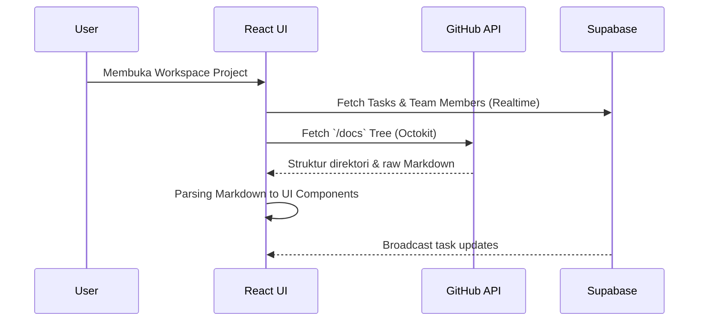

# Arsitektur Abstrakx Blueprint

Aplikasi Abstrakx Blueprint didesain dengan filosofi **"Zero-Clone" Zero-Friction**, memastikan seluruh dokumentasi (`/docs`) dan data kolaborasi dapat diakses secara _real-time_ dari desktop tanpa mewajibkan anggota tim untuk melakukan _cloning_ repositori.

## Teknologi Utama

- **Tauri (Rust):** Menangani interaksi dengan OS secara native, mengelola kunci akses dengan aman (Native Keychain), dan menjalankan jendela aplikasi dengan penggunaan RAM yang sangat rendah (biasanya di bawah 80 MB).
- **React.js + Vite:** Front-end _Single Page Application_ (SPA) dengan antarmuka bergaya Mintlify.
- **Supabase:** Melayani sinkronisasi data _real-time_ untuk manajemen tugas dan pengaturan tim (Auth & Postgres).
- **GitHub API (Octokit):** Menarik struktur direktori dan isi file markdown secara on-the-fly.

## Alur Data (Data Pipeline)

Berikut adalah urutan bagaimana data ditarik dan dirender ke antarmuka aplikasi:

💡 NOTE: All - Mode SPA React membuat transisi sangat cepat. Pastikan bundle size tetap kecil dan manfaatkan caching lokal Tauri Fs ke depannya.
