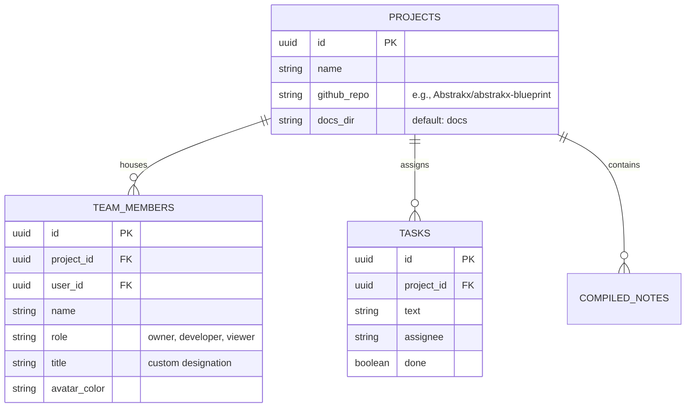

# Skema Database & Keamanan

Sistem backend menggunakan Supabase (PostgreSQL) yang dirancang untuk sinkronisasi seketika antar anggota tim.

## Entity Relationship Diagram (ERD)

Berikut adalah struktur relasional utama yang menopang _workspace_ ini:

## Row Level Security (RLS)

Keamanan tabel diatur dengan sangat ketat di level baris (Row Level Security):

- `projects`: Hanya anggota tim yang memiliki `user_id` di `team_members` yang dapat membaca atau memodifikasi tugas di dalam sebuah project.
- Pengguna yang masuk dengan akun Google secara otomatis diberikan peran `viewer`, sementara autentikasi GitHub memberikan hak akses `developer`.

💡 NOTE: All - Ketika menjalankan migrasi SQL baru, pastikan trigger RLS auth.users selalu dicek ulang agar integrasi OAuth login tetap mulus.
